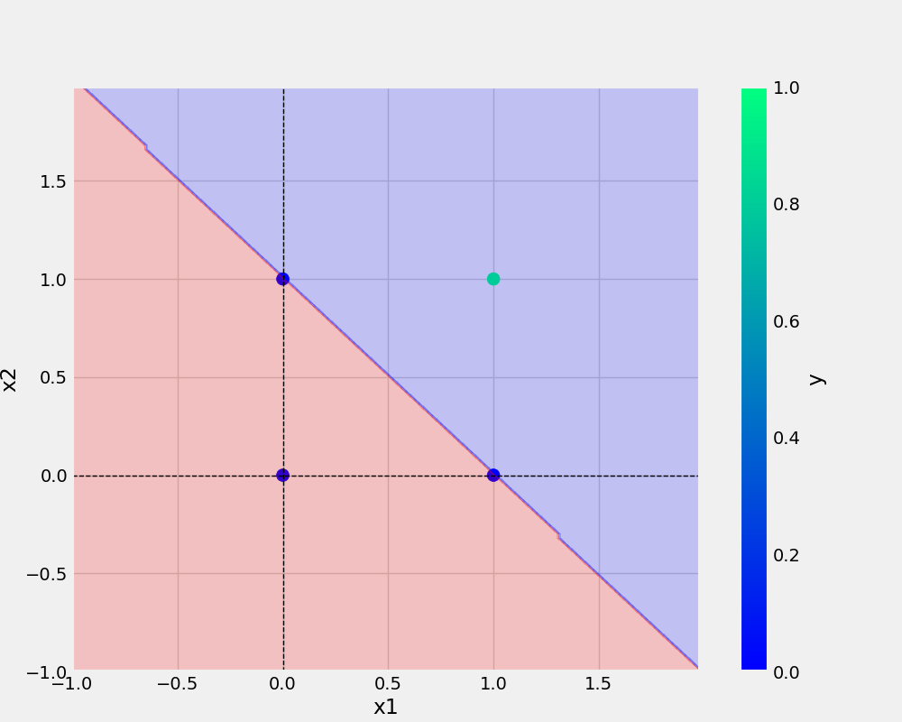

# Perceptron
Building an library to implement Perceptron learning algorithm from scratch

<br>

## Code to get Project Structure - Bash
```
tree.com //a //f
```

## Project Structure
```bash
\---Perceptron
    |   and.py
    |   README.md
    |   requirements.txt
    |
    +---IMAGES
    |       AND.png
    |
    +---logs
    |       running_logs.log
    |
    +---MODELS
    |       AND.model
    |
    \---utils
        |   all_utils.py
        |   model.py
        |   __init__.py
```

## Install Requirements
```
pip install requirements.txt
```

## Perceptron Class
```python
class Perceptron:
  def __init__(self):
    self.weights = None
    self.eta = 0.01
    self.epochs = 1
    self.error=0

  def activationFunction(self,input):
    z = np.dot(input,self.weights)
    return np.where(z>0,1,0)

  def fit(self,X,y,eta=0.01,epochs=1):
    self.eta=eta
    self.epochs=epochs

    X_with_bias = np.c_[X,-np.ones((len(X),1))]
    self.weights = np.random.randn(X_with_bias.shape[1])* 1e-4

    for i in tqdm(range(0,self.epochs),total=self.epochs,desc="training model"):
      y_hat = self.activationFunction(X_with_bias)
      self.error = y-y_hat
      self.weights = self.weights + self.eta * np.dot(X_with_bias.T, self.error)
      logging.info(f'At Epochs {i+1} Weights :{self.weights} ; Error : {sum(self.error*self.error)}')

      logging.info("--"*20)

  def predict(self, X):
    X_with_bias = np.c_[X, -np.ones((len(X), 1))]
    return self.activationFunction(X_with_bias)
```

## PLOTS


## Reference - 
[Python Documentation](https://packaging.python.org/tutorials/packaging-projects/)
[Github Actions](https://docs.github.com/en/actions/automating-builds-and-tests/building-and-testing-python#publishing-to-package-registries)